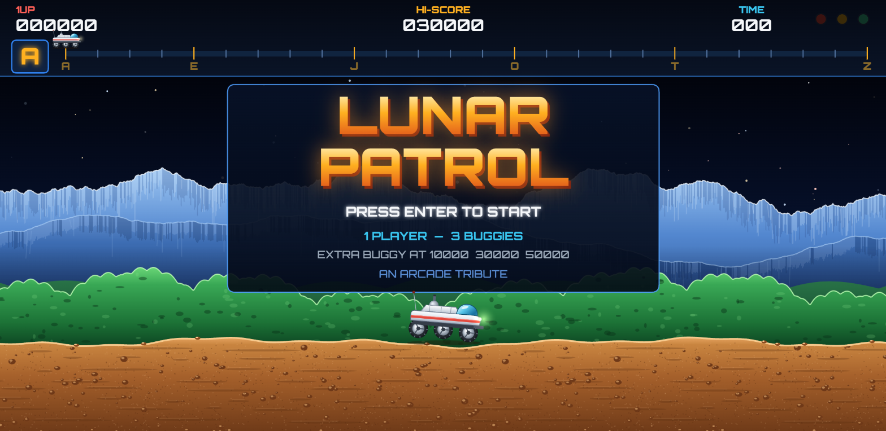
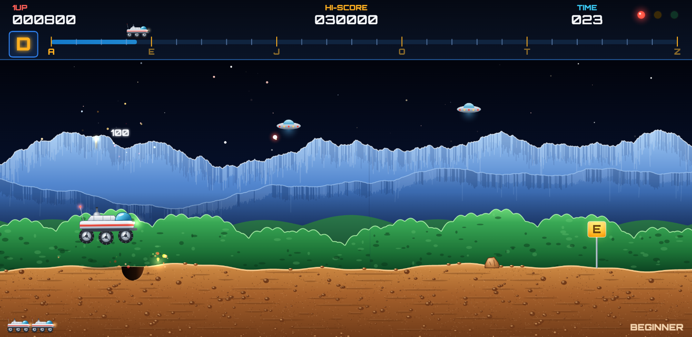
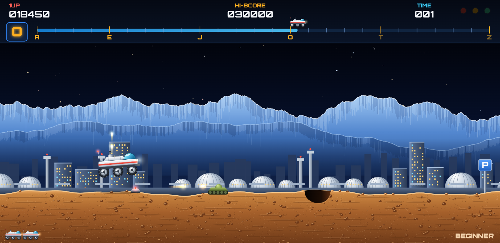
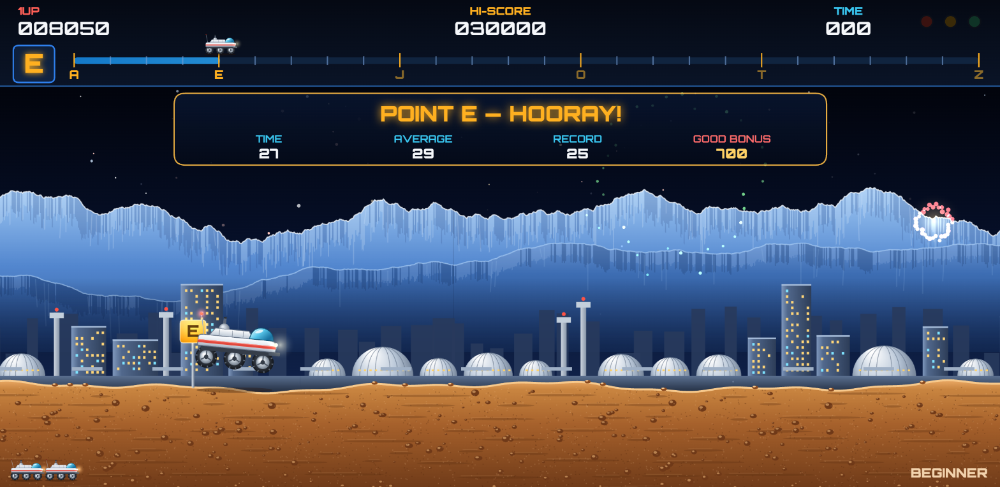
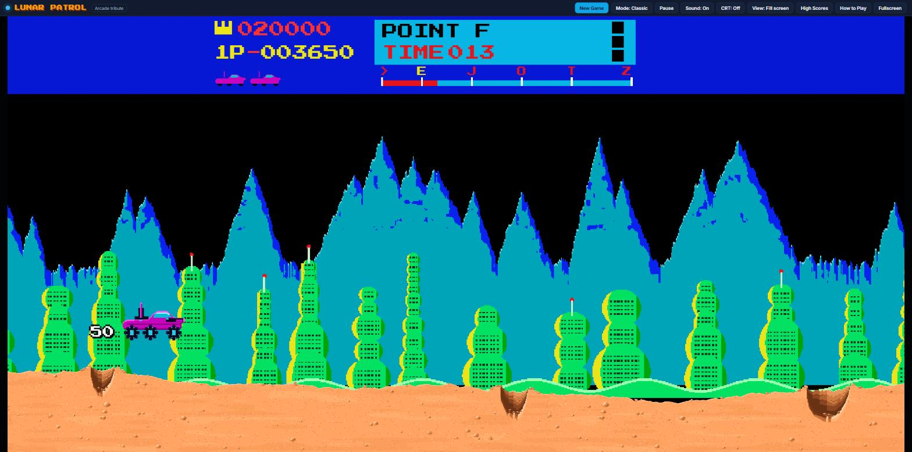

# Lunar Patrol



A high-resolution browser tribute to **Moon Patrol**, the 1982 arcade classic. Drive a
six-wheeled patrol buggy across the lunar surface from point **A** to point **Z**: jump
craters, blast rocks, and fight off attackers from the sky. As in the original, one fire button
shoots **forward and upward at once**.

It's plain HTML, CSS and JavaScript with no build step and no dependencies. There are two ways
to play, picked from a menu when the page opens (or any time with the **Mode** button):

- **Classic:** a pixel-art recreation of the 1982 arcade game, with its look, HUD and flow.
- **Remastered:** smooth vector graphics at your screen's native resolution.

Both fill the whole window.

## Play

**Play online:** https://robertorenz.github.io/moonpatrol5/

To run it locally instead:

With Node.js 18 or newer there's nothing to install:

```bash
git clone https://github.com/robertorenz/moonpatrol5.git
cd moonpatrol5
npm start        # serves the game at http://localhost:8080 (or the next free port)
npm run dev      # same, and opens it in your browser
```

| Script | What it does |
| --- | --- |
| `npm start` | Starts the bundled zero-dependency static server (`scripts/serve.js`). Set the port with `PORT=9000 npm start` or `npm start -- --port 9000`. |
| `npm run dev` | Same as `start`, and opens your default browser. |
| `npm run check` | Syntax-checks every JavaScript file. |

Any static server works too, for example `python -m http.server`. Opening `index.html`
straight from disk also works in most browsers.

### Controls

| Action | Keys |
| --- | --- |
| Speed up / slow down | `→` `←` (or `D` `A`) |
| Jump | `↑` `Space` `Z` `W` |
| Fire (forward + up) | `X` `Ctrl` `F` |
| Start | `Enter` |
| Pause | `P` `Esc` |
| Sound on/off | `M` |

Touch devices get on-screen buttons.

## Screenshots

| | |
| :---: | :---: |
|  |  |
| **Air attack:** jump craters and shoot down UFOs and their bombs | **Lunar city:** tanks, mines and craters on the ground |
|  |  |
| **Checkpoint:** stop, celebrate, and collect your time bonus | **Attract mode:** title, score table, demo play and high scores |

## Classic mode



Classic mode recreates the original coin-op as closely as possible. Shapes, colours and layout
were matched against screenshots of the arcade game, then redrawn at three times its pixel
resolution so they keep the original look with finer detail:

- **Sprites:** the magenta moon buggy with its rear anti-air gun, forward cannon and cyan-studded
  gear wheels; yellow domed saucers; a second saucer type; the tri-orb craft that lobs
  crater-making grenades; magenta bombs; stepped ochre rocks; rolling boulders; mines; tanks;
  and the rocket car that charges from behind (jump it). Explosions are spiky red and yellow
  bursts over grey smoke.
- **Scenery:** teal mountains with jagged deep-blue shading, then either rolling green hills with
  dark ridge streaks or the alien city of bulbous green towers, over the peach lunar ground.
- **A bumpy road:** the surface rolls through long swells and small lumps. Each wheel rides its
  own shock absorber and the body pitches with the terrain.
- **Real craters:** the road drops into a ragged bowl with a sunlit far wall showing soil layers,
  a shadowed near slope, rubble on the floor and ejecta piled on the lips. Drive into one and the
  buggy nose-dives in before it explodes. Grenades blast fresh, smoking craters.
- **The arcade HUD:** blue band with the crown high score and 1P score, the cyan POINT and TIME
  panel with three warning lamps (air attack, mines, attack from behind) and the course map.
- **Original rules and scoring:** 50 for jumping a hazard, 100 per saucer, rock or bomb, 200 per
  tri-orb or tank, 50 per boulder, squad bonuses of 500 / 800 / 1,000. Checkpoints pay 1,000
  plus 100 per second under the average time, and Z adds 5,000. One cannon shell at a time and
  up to four anti-air shots; cannon shells and tank shells cancel out.
- **Checkpoint report** in the original style, score advance table, demonstration play and a
  chip-style soundtrack (an original tune).
- **Sharp at any size:** sprites are drawn with nearest-neighbour scaling at the display's
  native resolution. *Fill screen* widens the playfield to the window; *Arcade 4:3* keeps the
  original shape. High scores and records are kept separately from Remastered mode.

## Features (Remastered)

- **Arcade gameplay:** a Beginner course A–Z, then a harder Champion course. Checkpoints at
  E, J, O, T and Z have timed bonuses, and losing a buggy restarts you at the last checkpoint.
- **Hazards:** small and wide craters, rocks (big ones split in two), rolling boulders, mines
  you can only jump, and tanks that fire shells along the ground.
- **Air attack:** three UFO types. Saucers drop bombs, orange pods drop bombs that blast new
  craters in your path, and green darts dive at you. Bombs fall slowly onto the scrolling
  ground, so you dodge them by speeding up or slowing down. Holding → lets the buggy drive
  well forward on the screen.
- **Checkpoint celebrations:** the action stops, enemies retreat, and the buggy rolls to a halt
  and hops under fireworks while a fanfare plays. A slim banner shows your time, the average
  time, the record and a bonus that counts up. Then it's "GO!" and back to driving. Reaching Z
  gets a longer celebration before the Champion course.
- **Presentation:**
  - Parallax star field and icy mountain ranges, with green hills or a lunar city skyline
    alternating between checkpoints.
  - Rolling cratered terrain.
  - A buggy whose body tilts on its suspension over bumps, take-offs and landings.
  - Glowing shots and explosions.
- **Views:** *Fill screen* widens the playfield to fit any window. *Arcade 4:3* keeps the
  original screen shape. Hazards engage at arcade distance, so both views play the same.
  There's also an optional CRT overlay.
- **Arcade touches:**
  - Warning lamps for air attack, ground attack and mines.
  - Extra buggies at 10,000, 30,000 and 50,000 points.
  - An attract mode with the title, score table, demo play and a top-5 high-score board
    (saved in `localStorage`).
- **Sound:** WebAudio-synthesized sound effects and an original chiptune soundtrack and
  fanfare.

## Project layout

```
index.html        page shell, modal dialogs, touch controls
docs/screenshots/ README images
package.json      npm scripts: start, dev, check
scripts/serve.js  zero-dependency static server used by npm start
css/style.css     page styling
js/audio.js       WebAudio sound effects, music sequencer, fanfare
js/game.js        Remastered mode: simulation, level generation, vector renderer
js/classic.js     Classic mode: simulation, pixel-art sprites and pixel renderer
js/ui.js          mode menu, dialogs, input mapping, resolution/view scaling, preferences
```

For testing, `Game._tick(frames, autopilot)` (or `Classic._tick` for Classic mode) advances the
simulation synchronously and `Game._state()` exposes the internal state. The built-in autopilot was used to check that the
generated courses have no impossible obstacle layouts.

## Credits

- **Moon Patrol** (1982) was developed and published by **Irem**. It was designed by
  **Takashi Nishiyama** and distributed in North America by **Williams Electronics**. This
  project is an homage to its gameplay and would not exist without it.
- Typefaces from Google Fonts, all under the SIL Open Font License:
  - **Orbitron** by Matt McInerney
  - **Inter** by Rasmus Andersson
  - **Press Start 2P** by CodeMan38
- Created by **Roberto Renz** with **Claude Code** (Anthropic).

## Disclaimer

Lunar Patrol is a non-commercial fan tribute. It is not affiliated with, endorsed by, or
connected to Irem or any rights holder of Moon Patrol. "Moon Patrol" is a trademark of its
respective owner. All code, graphics, sound effects and music in this repository are original
work created for this project. No assets from the original game are used.
